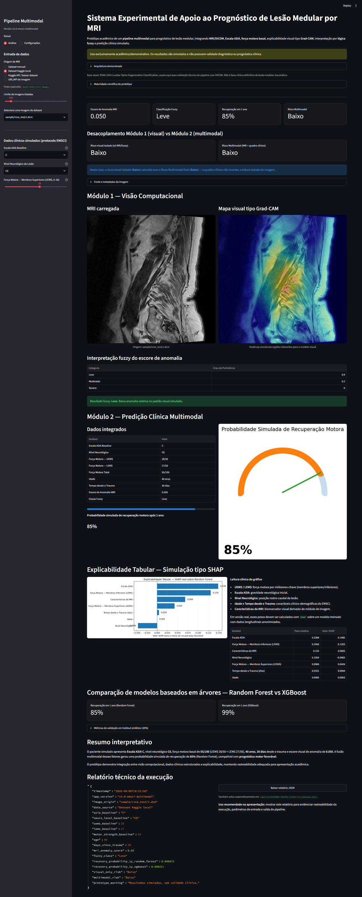
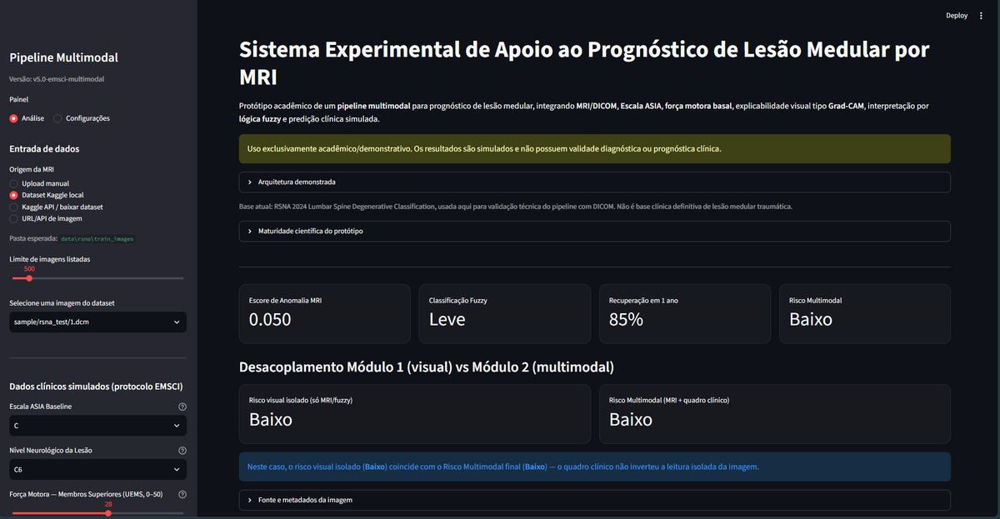

# Sistema Experimental — Pipeline Multimodal para Prognóstico de Lesão Medular por MRI

[](https://github.com/roberlancarvalho/lesao-medular-poc/actions/workflows/ci.yml)

**Demo pública:** [lesao-medular-poc.streamlit.app](https://lesao-medular-poc.streamlit.app/)

> **Aviso acadêmico:** este é um protótipo (PoC) experimental. Ele **não realiza diagnóstico
> nem prognóstico clínico real**. Os módulos de machine learning existem para demonstrar
> arquitetura, integração multimodal e explicabilidade — não possuem validade clínica.

Aplicação [Streamlit](https://streamlit.io/) que integra leitura de imagens de MRI/DICOM,
dados clínicos simulados inspirados no protocolo EMSCI (Escala ASIA, força motora por
miótomos-chave UEMS/LEMS, nível neurológico, idade, tempo desde o trauma), explicabilidade
visual (Grad-CAM), lógica fuzzy, um classificador de anomalia visual (Isolation Forest sobre
embeddings de ResNet50) e um modelo clínico (Random Forest + XGBoost, com SHAP) para gerar
uma probabilidade simulada de recuperação motora e um Risco Multimodal explícito.

## Capturas de tela

**Visão geral da execução** — MRI carregada, mapa Grad-CAM, interpretação fuzzy, predição
clínica (Random Forest x XGBoost), explicabilidade SHAP e relatório técnico:



**Topo da página e desacoplamento Módulo 1 vs Módulo 2** — aviso acadêmico, indicadores
principais (escore de anomalia, fuzzy, probabilidade, risco) e o painel que contrasta o risco
calculado só a partir da imagem (visual isolado) com o Risco Multimodal final, após a fusão
com o quadro clínico:



> No exemplo acima, os dois riscos coincidem (**Baixo**). Quando o quadro clínico é grave (ex.:
> Escala ASIA A, força motora baixa) mesmo com uma MRI classificada como "Leve", o painel
> destaca a divergência com um aviso — evidenciando que o Risco Multimodal pondera o contexto
> clínico em vez de replicar diretamente o sinal da imagem.

## Funcionalidades

- Leitura de imagens em PNG, JPG/JPEG e DICOM (upload manual, dataset local, Kaggle API ou URL).
- Extração de embeddings visuais com **ResNet50** (ImageNet) e geração de mapa **Grad-CAM** real.
- Escore de anomalia visual com **Isolation Forest** treinado sobre os embeddings.
- Classificação fuzzy (Leve / Moderado / Severo) a partir do escore de anomalia.
- Predição clínica com **Random Forest** treinado em dados sintéticos + explicabilidade com **SHAP**.
- Comparação lado a lado com **XGBoost** treinado na mesma base sintética (métricas de acurácia/AUC em holdout).
- Painel de configuração persistente (`.streamlit/app_config.json`) para caminhos de dataset,
  limites de listagem e credenciais do Kaggle.
- Download do relatório técnico da execução em JSON, com persistência automática em `reports/`
  (um arquivo por execução, com timestamp no nome, para auditoria posterior).

Quando uma dependência opcional (TensorFlow, SHAP, OpenCV) não está disponível no ambiente,
o app cai automaticamente em um modo simulado/heurístico equivalente, para nunca quebrar a
demonstração.

## Pré-requisitos

- **Python 3.10 a 3.13** (recomendado) para ter o backend visual real com **ResNet50/Grad-CAM**
  instalado automaticamente. Em **Python 3.14** o app continua funcionando normalmente (fuzzy,
  Random Forest, XGBoost, SHAP, Isolation Forest, leitura de DICOM), mas usando o heatmap
  visual simulado como substituto do Grad-CAM real, pois o TensorFlow ainda não possui build
  oficial para essa versão do Python.
- pip atualizado.
- (Opcional) Conta no [Kaggle](https://www.kaggle.com/) com API Key, caso queira baixar o
  dataset RSNA diretamente pela interface.

## Instalação

```bash
# 1. Clone o repositório
git clone <url-do-repositorio>
cd lesao-medular-poc

# 2. Crie e ative um ambiente virtual
python -m venv .venv

# Windows
.venv\Scripts\activate
# Linux/Mac
source .venv/bin/activate

# 3. Instale as dependências
python -m pip install --upgrade pip
python -m pip install -r requirements.txt
```

O arquivo `requirements.txt` cobre o pipeline completo, com **todas as versões fixadas**
(Streamlit, scikit-learn, XGBoost, SHAP, OpenCV, pydicom, kaggle, TensorFlow, etc.), conforme
a Seção 3.1.2 do artigo. O TensorFlow é instalado **automaticamente em Python 3.10 a 3.13**
(marcador `python_version < "3.14"` no requirements). Em **Python 3.14** o `pip install` pula
o TensorFlow — ainda não há build oficial dele para essa versão — e o app cai automaticamente
no heatmap visual simulado como substituto do Grad-CAM real.

## Executando a aplicação

```bash
streamlit run app.py
# no Windows, alternativamente:
py -m streamlit run app.py
```

O app abre automaticamente no navegador em `http://localhost:8501`.

## Como interpretar os resultados

Depois de carregar uma imagem e preencher os dados clínicos na barra lateral, clique em
**"Executar análise multimodal"** (ou deixe rodar automaticamente, se a opção estiver ativa
em Configurações). A tela principal mostra, em sequência:

1. **Escore de Anomalia MRI**, **Classificação Fuzzy** (Leve/Moderado/Severo) e a
   **probabilidade simulada de recuperação** em 1 ano.
2. **Risco visual isolado vs Risco Multimodal** — o ponto mais importante para entender a
   proposta do artigo. O primeiro vem só da imagem (Módulo 1); o segundo vem da fusão com o
   quadro clínico (Módulo 2). Quando eles **divergem**, o app avisa explicitamente — é o caso,
   por exemplo, de uma MRI "Leve" combinada com Escala ASIA A e força motora mínima, que ainda
   assim resulta em Risco Multimodal **Alto**.
3. **Módulo 1 (visão computacional)**: a MRI carregada lado a lado com o mapa Grad-CAM e a
   tabela de graus de pertinência fuzzy.
4. **Módulo 2 (predição clínica)**: as variáveis EMSCI usadas (ASIA, nível neurológico,
   UEMS/LEMS, idade, tempo desde o trauma), o gráfico de probabilidade e a explicabilidade
   SHAP.
5. **Comparação Random Forest vs XGBoost**, com métricas de acurácia/AUC em holdout sintético
   e explicabilidade SHAP para os dois modelos.
6. **Relatório técnico**: JSON com todos os parâmetros e saídas da execução, disponível para
   download e também salvo automaticamente em `reports/`. Quando o backend visual real está
   ativo, o embedding da ResNet50 (2048-d) também é salvo em `reports/embeddings/` e referenciado
   no relatório (`embedding_path`), para auditoria posterior.

Para reproduzir o cenário de desacoplamento descrito no artigo (imagem "leve" não implica
risco baixo), tente **Escala ASIA A**, **UEMS/LEMS próximos de 0** e uma imagem com escore de
anomalia baixo — o Risco Multimodal deve virar **Alto** mesmo com a classificação fuzzy
"Leve".

## Configurando o dataset (RSNA 2024 Lumbar Spine)

O app espera imagens DICOM organizadas como:

```text
data/rsna/train_images/{study_id}/{series_id}/{instance}.dcm
data/rsna/train_series_descriptions.csv
```

Existem três formas de obter os dados, todas configuráveis pela aba **Configurações** do app:

### Opção A — Kaggle API pela própria interface

1. Gere sua API Key em [kaggle.com/settings](https://www.kaggle.com/settings) (seção *API* → *Create New Token*), o que baixa um `kaggle.json` com `username` e `key`.
2. Abra o app, vá em **Configurações → Credenciais Kaggle** e informe usuário e chave. Isso salva localmente em `.streamlit/secrets.toml` (arquivo **não deve ser versionado** — veja a seção de segurança abaixo).
3. Ainda na aba **Análise**, selecione a origem **"Kaggle API / baixar dataset"** e use os botões **Baixar** e **Descompactar**.

### Opção B — Kaggle CLI manual

```bash
pip install kaggle
mkdir -p data/rsna
kaggle competitions download -c rsna-2024-lumbar-spine-degenerative-classification -p data/rsna
python -m zipfile -e data/rsna/rsna-2024-lumbar-spine-degenerative-classification.zip data/rsna
```

### Opção C — Upload manual ou URL

Não é necessário baixar o dataset completo: na aba **Análise**, escolha **"Upload manual"**
para subir uma imagem PNG/JPG/DICOM local, ou **"URL/API de imagem"** para apontar para um
endpoint que retorne os bytes da imagem.

## Configuração persistente do app

A aba **Configurações** permite ajustar e salvar (em `.streamlit/app_config.json`):

| Configuração | Padrão |
|---|---|
| Dataset root | `data/rsna` |
| Pasta de imagens | `data/rsna/train_images` |
| CSV de metadados | `data/rsna/train_series_descriptions.csv` |
| Competição Kaggle | `rsna-2024-lumbar-spine-degenerative-classification` |
| Limite padrão de imagens listadas | `500` |
| Executar análise automaticamente ao carregar imagem | ativado |

Depois de salvar, reinicie o Streamlit para garantir que todas as configurações sejam
aplicadas.

## Segurança: arquivos que não devem ir para o Git

Ao salvar credenciais Kaggle pela interface, o app cria `.streamlit/secrets.toml` com suas
credenciais em texto puro. **Nunca versione esse arquivo.** Um `.gitignore` já está incluído
neste repositório cobrindo:

- `.streamlit/secrets.toml`
- `.streamlit/app_config.json`
- `data/` (o dataset é baixado localmente, não deve ir para o repositório)
- ambientes virtuais, caches e artefatos (`.venv/`, `__pycache__/`, etc.)

## CI/CD

### CI — verificação automática (GitHub Actions)

A cada `push`/pull request na branch `main`, o workflow em
[`.github/workflows/ci.yml`](.github/workflows/ci.yml) roda em Python 3.11, 3.12, 3.13 e 3.14
(matriz), fazendo:

1. `python -m py_compile app.py` — garante que o arquivo não tem erro de sintaxe.
2. `ruff check --select F app.py` — lint (imports/variáveis não usadas, nomes indefinidos).
3. `pytest tests/` — smoke tests que carregam o `app.py` e exercitam fuzzy, Random Forest,
   XGBoost, o combinador de Risco Multimodal e a persistência do relatório (ver
   [`tests/test_smoke.py`](tests/test_smoke.py)).

A versão 3.14 na matriz também serve para garantir que o **fallback sem TensorFlow** (heatmap
simulado no lugar do Grad-CAM real) continua funcionando, já que o `requirements.txt` pula o
TensorFlow nessa versão do Python.

Para rodar os mesmos testes localmente antes de dar push:

```bash
pip install pytest ruff
python -m py_compile app.py
ruff check --select F app.py
pytest tests/ -v
```

### CD — deploy gratuito no Streamlit Community Cloud

O app pode ser publicado de graça em [share.streamlit.io](https://share.streamlit.io/) (conta
GitHub). O deploy lá é automático a partir do repositório conectado — não depende de um
workflow de CD no GitHub Actions, só da configuração inicial abaixo. Este projeto já está
publicado em **[lesao-medular-poc.streamlit.app](https://lesao-medular-poc.streamlit.app/)**,
reimplantado automaticamente a cada push na `main`.

1. Acesse [share.streamlit.io](https://share.streamlit.io/), entre com sua conta GitHub e
   clique em **"New app"**.
2. Selecione o repositório `lesao-medular-poc`, a branch `main` e o arquivo principal `app.py`.
3. Em **"Advanced settings"**, defina a versão do Python como **3.11, 3.12 ou 3.13** (o que
   estiver disponível no seletor do Streamlit Cloud) — é o que faz o `requirements.txt`
   instalar o TensorFlow de verdade (backend visual real do Grad-CAM). Se o seletor só oferecer
   uma versão mais nova sem TensorFlow disponível ainda, o deploy funciona do mesmo jeito, só
   cai no fallback simulado.
4. Clique em **"Deploy"**. Qualquer novo `push` na `main` reimplanta automaticamente.

**Duas observações importantes para essa PoC especificamente:**

- **Modo de dados recomendado para demo pública:** use **"Upload manual"** na aba Análise — não
  depende de dataset nem de credenciais Kaggle, funciona direto no ar. O modo "Kaggle API /
  baixar dataset" baixa vários GB e pode não caber no disco/tempo do plano gratuito.
- **Credenciais Kaggle (opcional):** se quiser habilitar o download do dataset no app já
  publicado, não use a tela de "Configurações" do próprio app em produção (ela grava em
  `.streamlit/secrets.toml`, que não persiste entre reinicializações no Cloud). Em vez disso,
  configure `KAGGLE_USERNAME` e `KAGGLE_KEY` no menu **"Secrets"** do painel do Streamlit
  Community Cloud — o app já lê essas credenciais de variável de ambiente/`st.secrets`
  automaticamente (`get_kaggle_credentials`).

## Estrutura do projeto

```text
app.py                        # aplicação Streamlit (ponto de entrada único, concentra todo o pipeline)
requirements.txt              # dependências do pipeline (nome exigido pelo Streamlit Community Cloud)
.github/workflows/ci.yml      # CI: lint + smoke test a cada push/PR
docs/screenshots/             # imagens usadas no README
.streamlit/                   # config local e credenciais (gerado em tempo de execução, não versionado)
data/                         # dataset local (não versionado)
reports/                      # relatórios JSON + reports/embeddings/ (não versionado)
```

## Maturidade científica do protótipo

| Módulo | Status |
|---|---|
| Leitura real de DICOM | ✅ Implementado |
| Interface clínica demonstrativa | ✅ Implementado |
| Embeddings ResNet50 + Grad-CAM | ✅ Real (TensorFlow instalado por padrão em Python 3.10–3.13); fallback simulado em Python 3.14 |
| Embeddings auditáveis | ✅ Persistidos em `reports/embeddings/` a cada execução real, referenciados no relatório JSON |
| Isolation Forest | ✅ Real (requer scikit-learn + embeddings) |
| Lógica fuzzy | ✅ Implementado (heurística); categoria fuzzy também entra como atributo do modelo tabular (não só o escore contínuo) |
| Predição clínica (Random Forest) | ✅ Real, treinado em dados **sintéticos** |
| Predição clínica (XGBoost, comparação) | ✅ Real (requer pacote `xgboost`), treinado em dados **sintéticos** |
| SHAP | ✅ Real sobre Random Forest **e** XGBoost (requer pacote `shap`); fallback heurístico quando indisponível |
| Dependências fixadas | ✅ `requirements.txt` com versões exatas (`==`), testadas em conjunto |

**Limitação importante:** o dataset usado (RSNA 2024 Lumbar Spine Degenerative
Classification) serve para validar tecnicamente o pipeline com imagens DICOM reais, mas
**não é uma base clínica de lesão medular traumática**, e o modelo clínico é treinado em
dados sintéticos. Resultados exibidos pelo app são simulados e não possuem validade
diagnóstica ou prognóstica.

## Licença

Defina a licença do projeto antes de publicar (ex.: MIT, Apache-2.0). Nenhuma licença está
definida por padrão neste repositório.
